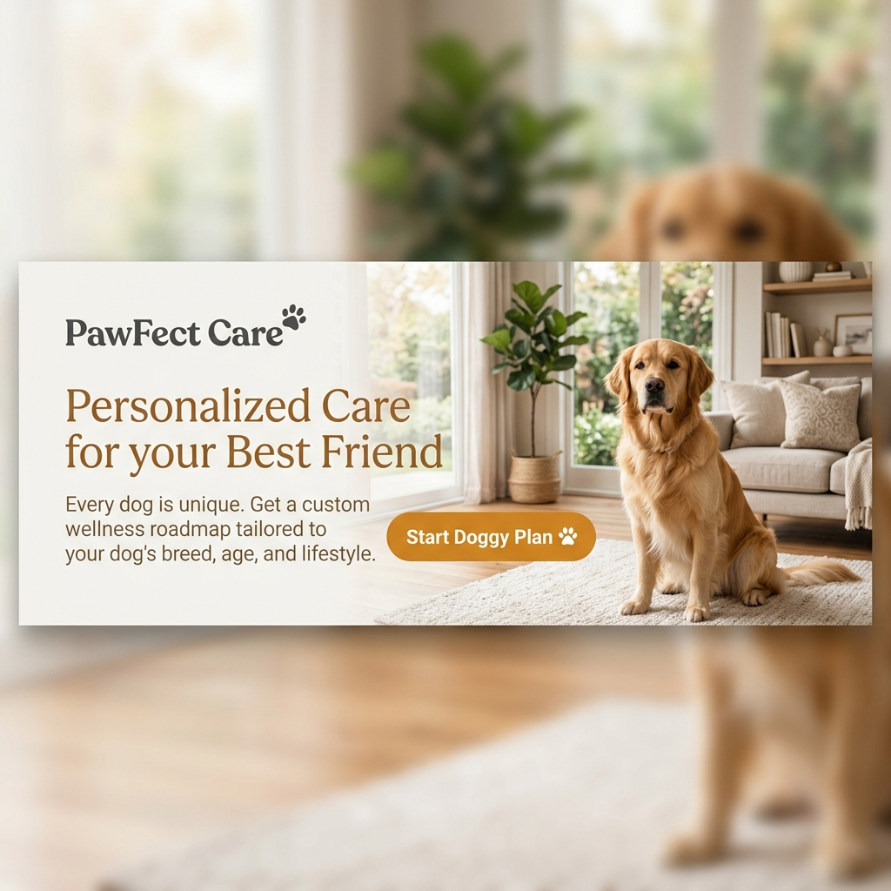

# 🐾 PawFect Care — Personalized Care Plans for Every Pet

[](https://github.com/Khushant15/PawFectCare)
[](https://opensource.org/licenses/MIT)
[](https://reactjs.org/)
[](https://tailwindcss.com/)

PawFect Care is a premium, modern web application designed to empower pet owners with data-driven, personalized care strategies. From intelligent nutrition planning to interactive health tools, PawFect Care provides a comprehensive ecosystem for ensuring your pet's well-being.

## 🚀 Live Demo

Check out the live application here: [https://pawfectcareweb.netlify.app/](https://pawfectcareweb.netlify.app/)

## 🌟 Features

### 🛠 Interactive Tools
- **🧠 Personality Quiz**: Understand your pet's unique traits and behaviors.
- **🐕 Dog Age Calculator**: Accurately translate your dog's age into human years.
- **✅ Daily Checklist**: A dynamic tool to ensure no meal, walk, or medication is missed.

### 📋 Comprehensive Care
- **✨ Personalized Plans**: Tailored recommendations for nutrition, grooming, and exercise based on breed, age, and health history.
- **🔍 Breed Discovery**: Deep-dive into breed characteristics to understand your pet's ancestral needs.
- **🍪 Healthy Recipes**: A curated collection of homemade, pet-safe treat recipes.

### 🎨 Design & Experience
- **💎 Premium UI**: Built with a sleek, modern aesthetic featuring smooth transitions and micro-animations.
- **📱 Responsive Design**: Optimized for a flawless experience on desktops, tablets, and smartphones.
- **⚡ High Performance**: Powered by Vite for lightning-fast load times and interaction.

## 🚀 Tech Stack

- **Frontend**: [React 19](https://reactjs.org/)
- **Styling**: [Tailwind CSS 4](https://tailwindcss.com/)
- **Icons**: [Lucide React](https://lucide.dev/)
- **Bundler**: [Vite 6](https://vitejs.dev/)

## 📸 Preview




## 🛠 Installation & Setup

1. **Clone the repository**
   ```bash
   git clone https://github.com/Khushant15/PawFectCare.git
   ```

2. **Navigate to project directory**
   ```bash
   cd PawFectCare
   ```

3. **Install dependencies**
   ```bash
   npm install
   ```

4. **Start development server**
   ```bash
   npm run dev
   ```

## 🌐 Deployment

This project is optimized for deployment on modern platforms like **Vercel**, **Netlify**, or **GitHub Pages**.

### Deploy to Netlify
1. Push your code to GitHub.
2. Connect your repository to [Netlify](https://www.netlify.com/).
3. Set the build command to `npm run build` and the publish directory to `dist`.

### Deploy to Vercel
1. Install the Vercel CLI: `npm i -g vercel`.
2. Run `vercel` in the root directory and follow the prompts.

## 📦 Building for Production

To create an optimized production build, run:
```bash
npm run build
```
The output will be in the `/dist` folder.

## 📄 License

Distributed under the MIT License. See `LICENSE` for more information.

---
Built with ❤️ for pets everywhere by [Khushant](https://github.com/Khushant15)
